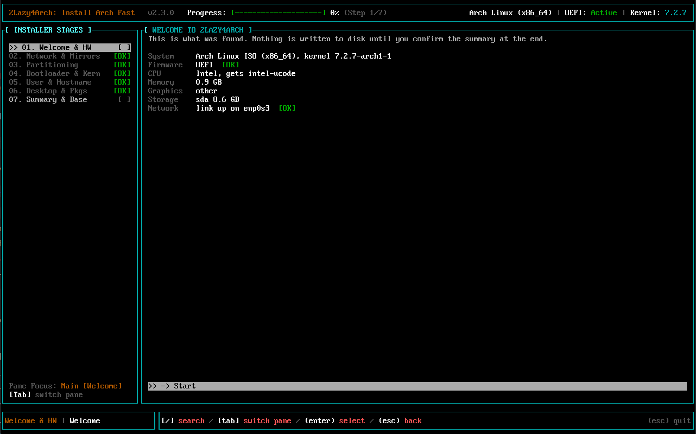
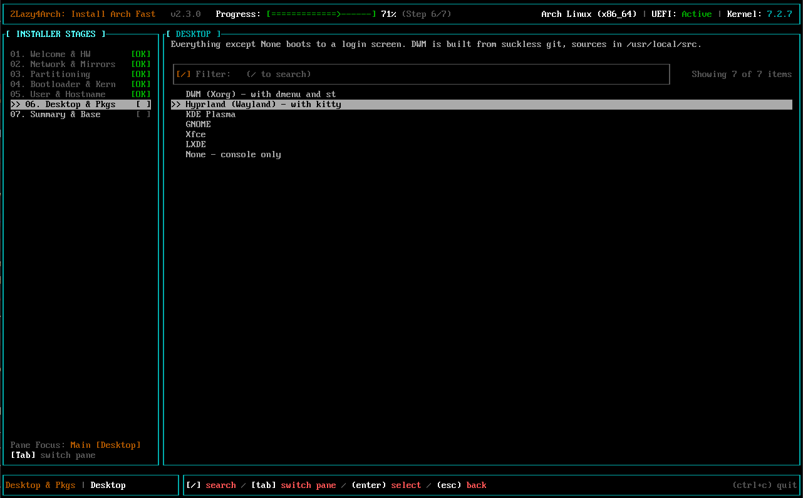
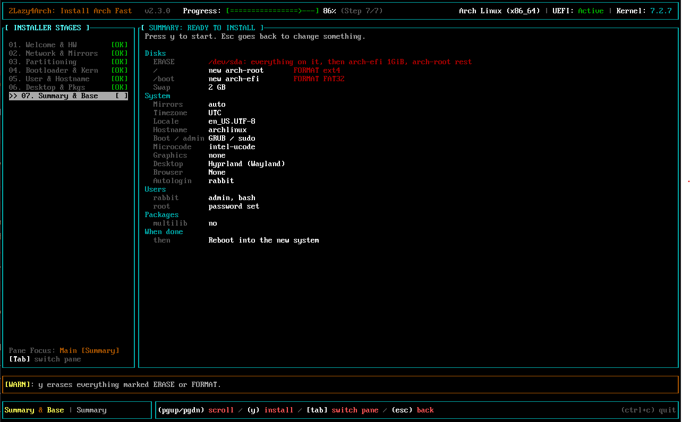

# 2Lazy4Arch: Installing Arch Really Fast
A dead simple, fast and opinionated Arch Linux Installer, written in Rust.

Click through a wizard, or describe the whole machine in one YAML file and let it install unattended.

## What to Expect?
- **Two ways in:** a step-by-step TUI, or a declarative config file (local or a URL) that installs with no questions asked.
- **Any common hardware:** Intel and AMD CPUs (microcode picked automatically), Intel, AMD and NVIDIA GPUs, hybrid laptops included.
- **Proprietary drivers, your call:**
  - NVIDIA: `nvidia-open` (GTX 16xx / RTX and newer), legacy `nvidia-580xx` (GTX 9xx / 10xx, AUR) or `nouveau`. The default is picked from your card's generation. Hybrid laptops also get `nvidia-prime` (`prime-run`).
  - AMD: Mesa, or Mesa + AMDGPU PRO (proprietary Vulkan and AMF, AUR).
  - Intel: always Mesa (`vulkan-intel`, `intel-media-driver`).
- **Desktop / window manager**, each booting to a login screen: DWM (Xorg, built from suckless git with dmenu and st), Hyprland (Wayland), KDE Plasma, GNOME, Xfce, LXDE, or none.
- **Browser:** Firefox, LibreWolf, Chromium, Epiphany (GNOME Web), Konqueror, qutebrowser, Falkon, or from the AUR: Zen, Google Chrome.
- **Disks:** erase a disk, use the free space next to Windows, or pick partitions yourself (`cfdisk` is built in). Extra partitions can be mounted as they are.
- **Users:** any number, admins or not, with zsh or fish, extra groups, SSH keys (or your GitHub keys), autologin. Root can stay locked.
- **Extras:** SSH, Tailscale, VNC, Docker and Compose, multilib, extra pacman and AUR packages.
- **Config file only:** wifi / ethernet / PPPoE connections (WPA2/3, enterprise EAP, static IPs, VLANs), DNS over TLS, a proxy, Docker containers started on first boot, apps and services started at login and boot, and your own hooks before and after the install.
- **Safe by default:** nothing is touched until you confirm a full review, and the config is checked against the machine first: disks, free space, users, interfaces, files. Package names that don't exist are skipped and listed instead of failing the whole install.
- Reflector-ranked mirrors, a swap file instead of a swap partition, sudo or doas, GRUB (with os-prober for dual boot) or systemd-boot, yay for the AUR.
- UEFI only.
- Every install gets:
```
base linux linux-firmware intel-ucode/amd-ucode neovim reflector
efibootmgr os-prober ntfs-3g networkmanager network-manager-applet
wireless_tools wpa_supplicant dialog mtools dosfstools base-devel
linux-headers bluez bluez-utils pipewire pipewire-pulse pipewire-jack
pipewire-alsa wireplumber alsa-utils git cups
```

## Screenshots
What was found on the machine, before anything else:



Picking a desktop:



The summary, with everything that will be erased or formatted in red, before `y` starts the install:



## How To Use?
Boot the Arch ISO in UEFI mode and get online (`iwctl` for wifi; ethernet just works). Then, as root:

```sh
curl -fsSL https://raw.githubusercontent.com/parapsychic/2lazy4arch/main/install.sh | bash
```

[install.sh](install.sh) downloads the latest release to `/usr/local/bin/2lazy4arch` and runs it. Arguments after `bash -s --` are passed on, and `LAZY_VERSION` picks a release instead of the latest:

```sh
curl -fsSL https://raw.githubusercontent.com/parapsychic/2lazy4arch/main/install.sh | LAZY_VERSION=v2.1.0 bash
```

Or download the binary yourself:
```sh
curl -L https://github.com/parapsychic/2lazy4arch/releases/latest/download/2lazy4arch --output 2lazy4arch
chmod +x 2lazy4arch
./2lazy4arch
```

When the install is done it reboots, powers off or stays on the ISO, whichever you picked. Rebooting and powering off wait 10 seconds first, and `ctrl+c` stays instead, with the new system mounted at `/mnt`. Everything the install printed is in `/var/log/2lazy4arch.log`, on the ISO and in the new system.

### The wizard
Run `2lazy4arch` with no arguments. The sidebar shows where you are and what you picked.

- `↑↓` (or `jk` on short lists) to move, `enter` to pick, `esc` to go back, `ctrl+c` to quit.
- Mirrors, timezones and locales filter as you type.
- In forms, `tab` or `↑↓` moves between fields and `enter` confirms.
- Nothing is written to disk until you press `y` on the review screen. The exception is `cfdisk`, which saves as you go.

After `y`, the install runs inside the TUI: its output in a terminal frame (pacman's own progress bars included), the current task, an overall progress bar and the elapsed time. `pgup`/`pgdn` scroll back through the output, anything you type goes to the installer (it may ask whether to skip packages that don't exist), and `ctrl+c` aborts. Once it's done, `q` leaves.

The steps:
1. Partitioning: pick a disk to erase, use its free space or edit in cfdisk, or continue and pick the EFI, root and home partitions
2. Other mounts, swap, mirrors, timezone, locale
3. Your user and root, your shell, more users
4. Bootloader, admin tool, NVIDIA and AMD drivers (only when that GPU is there)
5. Desktop, autologin, browser, Wi-Fi (only with a wifi card)
6. Extras: SSH, Tailscale, VNC, Docker, multilib, the ParaPsychic rice
7. Extra packages, and what to do when done

The review screen runs the same checks as a config file and lists any problem in red; `y` only works once they're fixed. What you picked is saved in the new system as `/etc/2lazy4arch/config.yaml`, minus passwords and keys, so the same install can be repeated as a config file.

### Declarative install
Describe the machine in YAML and install it in one go:

```sh
2lazy4arch --config-file my-arch.yaml
2lazy4arch --config-file https://example.com/my-arch.yaml
curl -fsSL https://raw.githubusercontent.com/parapsychic/2lazy4arch/main/install.sh \
  | bash -s -- --config-file https://example.com/my-arch.yaml --no-confirm
```

| Flag | |
|---|---|
| `--config-file <path or URL>` | Read the config from a file, or from any URL `curl` can fetch (`http://`, `https://`, ...). Paths inside it (scripts, package lists, certificates, compose files) are relative to the config; for a URL they're downloaded from next to it. |
| `--no-confirm` | Skip the preview. The install starts right away and nothing is ever asked; packages that aren't in the repos are skipped. |
| `--no-validate` | Skip the checks below. |

[unattended-config.yaml](unattended-config.yaml) is a full, commented example of every key and its default. [unattended-config-schema.json](unattended-config-schema.json) is its schema; editors with the YAML language server (VS Code's YAML extension, for one) complete and check keys as you type.

The smallest config that installs erases the machine's only internal disk and makes one admin user:
```yaml
version: 1
storage:
  partitioning:
    - disk: auto
      wipe: true
users:
  - name: parapsychic
    password_hash: "$6$..."   # from: openssl passwd -6
```

Before anything happens:
1. **Schema.** The config has to match the schema, or the install stops with `Configuration is invalid:` and every problem with where it is, like `users/0/name: ...`.
2. **This machine.** Then it checks that the config would work here, or stops with `Configuration would not work with this system:` and the reasons. It checks that:
   - the machine booted in UEFI mode
   - `disk: auto` finds exactly one internal disk, named disks exist, new partitions fit in the free space, and `size: rest` is only on the last one
   - every partition reference (`/dev/...`, `PARTLABEL=`, `PARTUUID=`, `UUID=`, `LABEL=`) matches exactly one partition, nothing is mounted twice, and other mounts already have a filesystem
   - usernames are unique and not root, someone can administer the machine (an admin user or a root password), and `autologin`, `as:` and user lists name real users
   - `listen: tailscale` has Tailscale turned on, and VNC has a desktop and a password
   - the mirror country, timezone, locale and network interfaces exist, and wifi connections have a wifi card
   - every file named in the config can be read
3. **Preview.** A review screen shows what will happen: disks to erase and format, users, drivers, network, remote access, packages, Docker, hooks. `y` installs inside the TUI, like the wizard; `esc` quits with nothing changed. With `--no-confirm` there's no TUI at all, just the install's output.

Then, in order:
1. Get online with your connections, unless the ISO already is
2. `pre_install` hooks
3. Mirrors and the package check
4. Partition, format and mount, then pacstrap
5. Configure the new system
6. `post_install` hooks
7. As your users: AUR packages, the rice, autostart apps, `post_setup` hooks
8. `finish`

Tailscale joins and Docker containers start on the first boot. Any failure stops the install and skips `finish`.

### After installing
On the installed system, as your user, `2lazy4arch --user-setup` installs AUR packages with yay (setting yay up first if needed), or applies the rice:
```sh
2lazy4arch --user-setup visual-studio-code-bin spotify
2lazy4arch --user-setup --rice
```

#### [Note to me] ParaPsychic Mode
My dotfiles, my dwm/dmenu builds, multilib, pacman candy and the touchpad config: the "ParaPsychic rice" extra in the wizard, or `parapsychic_mode: true` in a config.

#### Compiling
Install rust by following this [guide](https://www.rust-lang.org/learn/get-started).

Then, clone this repo and compile it.
```sh
git clone https://github.com/parapsychic/2lazy4arch.git
cd 2lazy4arch
cargo build --release
cargo test
```
The compiled binary will be at `target/release/toolazy4arch`. The naming is different as rust does not allow first character to be a digit.


## How To Extend?
### Config keys
The config is `Config` in [installer/src/config.rs](installer/src/config.rs), mirroring [unattended-config-schema.json](unattended-config-schema.json). Add a key to both. A test checks the example config against the schema, so update [unattended-config.yaml](unattended-config.yaml) too.

### Drivers, desktops, browsers
They all map to packages in `Config::packages()` in [installer/src/config.rs](installer/src/config.rs). The choices shown in the wizard live in [tui/src/app.rs](tui/src/app.rs).

### Hooks
For one-off tweaks, no code needed: `hooks.pre_install`, `post_install` and `post_setup` in a config run your own commands or scripts at each stage. See [unattended-config.yaml](unattended-config.yaml).

### Ricing
The rice is `PostInstall::misc_options` in [installer/src/post_install.rs](installer/src/post_install.rs). To rice with your own dotfiles, change `DOTFILES_REPO`, `GIT_NAME` and `GIT_EMAIL` at the top of that file and edit the steps, then [compile](#compiling).

## Problems?
It Just Works<sup>TM</sup>  


But in case it doesn't, [click here](https://newfastuff.com/wp-content/uploads/2019/05/5p3oYv1.png) or open an issue and cross your fingers.

Built with ❤️ and Rust

<sup>Hire me Bethesda, I'll work for minimum wage.</sup>

<a href="https://youtu.be/Eweu-mHzmq4?si=pAnmXEZV0725b7rS" target="_blank" rel="noopener"></a>


🫰 I'll probably switch to Nix OS after this...
